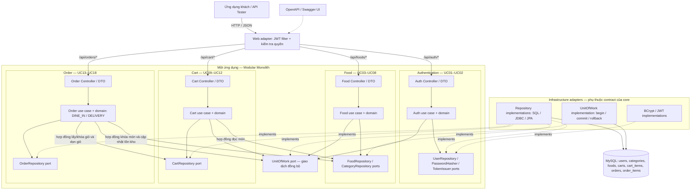
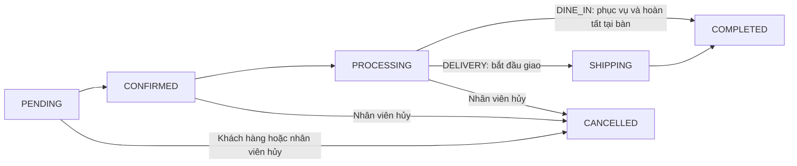

# ByteMe — Kiến trúc và checkout cho một nhà hàng

Đây là bản sơ đồ hiện hành sau khi chốt phạm vi một nhà hàng, có ăn tại chỗ (`DINE_IN`) và giao về nhà (`DELIVERY`). [Use case UC01–UC18](Project%20KTPM.md) xác định yêu cầu nghiệp vụ; [thiết kế database](database-design.md) xác định bảng và ràng buộc. Hai ảnh `2. architecture.png` và `2. sequence diagram.png` được giữ làm bản tham khảo ban đầu.

## Rà soát hai sơ đồ ban đầu

| Nội dung trong bản cũ | Điều chỉnh và lý do |
| --- | --- |
| Bốn module Authentication, Food, Cart, Order | Giữ nguyên, tương ứng UC01–02, UC03–08, UC09–12, UC13–18. Một nhà hàng không cần module hay bảng `restaurants`. |
| Kiến trúc dùng Spring ApplicationEvent Bus để xóa giỏ bất đồng bộ, sequence lại gọi `clearCart` đồng bộ | Chọn checkout đồng bộ trong một giao dịch: tạo đơn/chi tiết, trừ tồn kho và dọn giỏ cùng commit. Xóa giỏ bất đồng bộ có thể khiến đơn thành công nhưng giỏ chưa xóa hoặc xóa nhầm những món khách vừa thêm. |
| Spring Boot bao quanh cả core và các service | Spring là adapter ở tầng web/persistence. Use case và domain là Java thuần, chỉ phụ thuộc contract Repository/UnitOfWork; không import Spring, JPA hay JDBC. Điều này giữ nghiệp vụ độc lập framework theo yêu cầu KTPM. |
| `CartService` gửi SQL trực tiếp tới database trong sequence | Mọi đọc/ghi đi qua Repository port và persistence adapter. SQL chỉ có trong adapter. |
| `DELETE FROM cart_items WHERE user_id = ...` | `cart_items` thuộc `carts` qua `cart_id`, không có `user_id`. Xác định cartId từ người dùng đã xác thực rồi gọi `CartRepository.clearItems(cartId)`; adapter xóa theo `cart_id`. |
| Sequence chỉ kiểm tra trạng thái món, không thể hiện khóa/trừ tồn kho hay rollback | Thêm khóa giỏ và khóa món theo foodId tăng dần, kiểm tra tồn kho và rollback mọi thay đổi khi lỗi. Các thao tác sửa giỏ cũng phải khóa cùng hàng `carts`; thao tác sửa tồn kho dùng cùng cơ chế khóa hàng `foods`. |
| Đơn không thể hiện hình thức phục vụ | UC13 và sequence tách kiểm tra/snapshot bàn cho DINE_IN, người nhận/SĐT/địa chỉ cho DELIVERY. |
| Database ghi `PostgreSQL / MySQL` | Chọn MySQL theo cấu hình và schema SQL của project. |

Đây là thiết kế cho phần nghiệp vụ cần triển khai. Các controller/service/repository trong sơ đồ không đồng nghĩa rằng toàn bộ API đã được code trong starter.

## Sơ đồ kiến trúc



Các mũi tên nét liền bên trong module thể hiện lời gọi qua contract. Mũi tên `implements` thể hiện adapter triển khai interface do core định nghĩa. Core không biết kiểu connection hay thư viện persistence; composition root ghép các implementation và bảo đảm các repository dùng cùng giao dịch khi chạy một checkout. Authentication có các port khác nhau cho truy cập user, băm mật khẩu và cấp token; node trong hình gom chúng để sơ đồ dễ đọc.

Trong giai đoạn 1, đồng bộ checkout qua các port của module, không dùng event bus bất đồng bộ. `UnitOfWork` cung cấp ranh giới giao dịch mà không buộc service nghiệp vụ phải gắn `@Transactional` hoặc import framework. Khi test business logic, thay Repository/UnitOfWork bằng test double để chạy độc lập hạ tầng.

## Sequence UC13 — Tạo đơn hàng

```mermaid
sequenceDiagram
    autonumber
    actor Customer as Khách hàng
    participant JWT as Web adapter / JWT
    participant API as Order Controller
    participant Service as CreateOrder use case
    participant UOW as UnitOfWork adapter
    participant Cart as CartRepository adapter
    participant Food as FoodRepository adapter
    participant Order as OrderRepository adapter
    participant DB as MySQL

    Customer->>JWT: POST /api/orders + Bearer JWT + orderType
    JWT->>JWT: Xác thực token và quyền CUSTOMER
    alt Token không hợp lệ hoặc hết hạn
        JWT-->>Customer: 401 Unauthorized
    else Vai trò không có quyền đặt món
        JWT-->>Customer: 403 Forbidden
    else Khách hàng hợp lệ
        JWT->>API: userId từ JWT + request
        API->>Service: createOrder(userId, request)
        Service->>Service: Kiểm tra orderType và paymentMethod
        alt DINE_IN
            Service->>Service: tableNumber bắt buộc, tối đa 20 ký tự; không có trường giao hàng
        else DELIVERY
            Service->>Service: Người nhận / SĐT / địa chỉ bắt buộc; không có tableNumber
        end
        alt Thông tin phục vụ / thanh toán không hợp lệ
            Service-->>API: Validation error
            API-->>Customer: 400 Bad Request
        else Thông tin hợp lệ
            Service->>UOW: begin()
            UOW->>DB: BEGIN
            Service->>Cart: lockCartByUserId(userId) và lấy Cart Item
            Cart->>DB: SELECT carts FOR UPDATE; đọc cart_items theo cart_id
            DB-->>Cart: Cart và các item
            Cart-->>Service: Cart snapshot
            alt Giỏ không tồn tại hoặc rỗng
                Service->>UOW: rollback()
                UOW->>DB: ROLLBACK
                Service-->>API: Business error
                API-->>Customer: 400 giỏ rỗng / 404 giỏ không tồn tại
            else Giỏ có món
                Service->>Food: lockFoods(foodIds theo thứ tự tăng dần)
                Food->>DB: SELECT foods FOR UPDATE theo foodId
                DB-->>Food: Giá, trạng thái và tồn kho hiện tại
                Food-->>Service: Các món đã khóa
                Service->>Service: Kiểm tra món tồn tại, ACTIVE, số lượng và tồn kho
                alt Món / số lượng không hợp lệ
                    Service->>UOW: rollback()
                    UOW->>DB: ROLLBACK
                    Service-->>API: Business error
                    API-->>Customer: 400 / 404 / 409 theo nguyên nhân
                else Đủ điều kiện đặt
                    Service->>Service: Tính tổng tiền; snapshot tên và giá món
                    alt DINE_IN
                        Service->>Service: Snapshot tableNumber; trường giao hàng null
                    else DELIVERY
                        Service->>Service: Snapshot thông tin nhận hàng; tableNumber null
                    end
                    Service->>Order: saveOrderAndItems(status=PENDING)
                    Order->>DB: INSERT orders và order_items
                    Service->>Food: decreaseStock(foods, quantities)
                    Food->>DB: UPDATE foods.stock_quantity
                    Service->>Cart: clearItems(cartId)
                    Cart->>DB: DELETE cart_items WHERE cart_id = ?
                    alt Mọi ghi dữ liệu thành công
                        Service->>UOW: commit()
                        UOW->>DB: COMMIT
                        Service-->>API: Order result với snapshot đã lưu
                        API-->>Customer: 201 Created + orderType + chi tiết đơn
                    else Có lỗi persistence trước commit
                        Service->>UOW: rollback()
                        UOW->>DB: ROLLBACK
                        Service-->>API: Persistence error
                        API-->>Customer: 500 Internal Server Error
                    end
                end
            end
        end
    end
```

Bất kỳ lỗi repository nào trong giao dịch, kể cả lúc đọc/khóa giỏ hoặc món, đều phải rollback trước khi trả lỗi. Sequence gom nhánh lỗi persistence ở cuối để tránh lặp hình. Khi giỏ không tồn tại/rỗng, use case dừng kiểm tra và rollback ngay; không cần truy vấn khóa món. Toàn bộ Cart Item được đọc từ server, giá và tổng tiền do server tính. Lock phải được giữ đến commit/rollback; các repository dùng cùng context giao dịch.

## Trạng thái theo hình thức phục vụ



Nhân viên chỉ hủy trước SHIPPING/COMPLETED theo quy tắc đã chọn. Hủy và phục hồi tồn kho phải nằm trong một giao dịch, khóa đơn để hai yêu cầu không phục hồi hai lần. DINE_IN không có SHIPPING; CASH chỉ cho DINE_IN, COD chỉ cho DELIVERY và BANK_TRANSFER dùng cho cả hai. Trường `tableNumber` giai đoạn này là nhãn bàn được lưu trong đơn, không thêm chức năng đặt bàn hoặc quản lý bàn.
