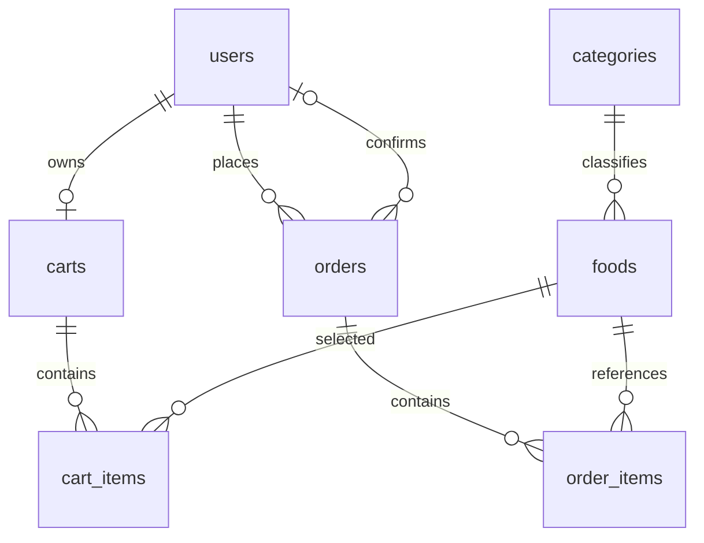

# Database ByteMe

MySQL 8.4/InnoDB cho [UC01–UC18](Project%20KTPM.md), phục vụ một nhà hàng.
Schema được tạo trực tiếp bằng SQL; dữ liệu mẫu là một script riêng, tùy chọn.

## Bảng và quan hệ



FK cho phép tạo header đơn trước chi tiết. Một đơn hợp lệ phải có ít nhất một
`order_items` trước khi commit; database chưa tự bắt buộc điều kiện này.

| Bảng | Dữ liệu và ràng buộc chính |
| --- | --- |
| `users` | Họ tên, email/SĐT unique, BCrypt hash; một vai trò `CUSTOMER`/`EMPLOYEE`/`ADMIN`; trạng thái `ACTIVE`/`INACTIVE`/`LOCKED` |
| `categories` | Tên, mô tả; unique `normalized_name = LOWER(TRIM(name))` |
| `foods` | Một danh mục, tên, mô tả, ảnh, giá > 0, tồn kho ≥ 0, trạng thái `ACTIVE`/`INACTIVE`; tên chuẩn hóa unique toàn menu |
| `carts` | FK người dùng; `user_id` unique nên mỗi tài khoản có tối đa một giỏ |
| `cart_items` | FK giỏ/món; số lượng > 0; unique `(cart_id, food_id)` |
| `orders` | FK chủ đơn/người xác nhận; loại đơn, thông tin bàn/giao hàng, phương thức, trạng thái và thời gian |
| `order_items` | FK đơn/món; snapshot tên, giá > 0, số lượng > 0; unique `(order_id, food_id)`; `line_total` tự tính |

Định nghĩa đầy đủ: [schema.sql](../src/main/resources/db/schema.sql).

## Quy tắc dữ liệu

- Tên món/danh mục không phân biệt hoa thường và khoảng trắng đầu/cuối, có phân
  biệt dấu. Một món thuộc một danh mục và có một giá dùng cho cả hai loại đơn.
- `stock_quantity` là số suất còn có thể đặt, do Admin cập nhật. `ACTIVE` nhưng
  tồn kho bằng 0 nghĩa là đang bán nhưng hết suất. Thêm vào giỏ chưa giữ hàng;
  checkout trừ kho, hủy hợp lệ hoàn kho đúng một lần.
- Tiền dùng `DECIMAL(15,2)` và Java `BigDecimal`. Chưa có phí, thuế hoặc giảm giá.
  `order_items.line_total = unit_price * quantity` là cột generated.
- Không lưu tổng riêng trong `orders`. View `order_totals(order_id, total_amount)`
  tính tổng từ snapshot chi tiết, không lấy giá hiện tại trong `foods`.
  Header chưa có chi tiết trả tổng 0 để có thể phát hiện đơn thiếu dữ liệu.
- Snapshot tên/giá món và thông tin phục vụ giữ lịch sử khi hồ sơ/menu thay đổi.
  Chi tiết đơn không được chỉnh sửa sau checkout; schema chưa tự cấm sửa/xóa snapshot.
- Timestamps dùng `DATETIME(6)` theo UTC. `version` trên món, giỏ và đơn hỗ trợ
  kiểm soát cập nhật đồng thời; database không tự tăng cột này.

Đọc tổng đơn:

```sql
SELECT o.id, o.status, ot.total_amount
FROM orders o
JOIN order_totals ot ON ot.order_id = o.id;
```

## Hình thức phục vụ

`order_type` bắt buộc ghi rõ, không có default. CHECK bảo vệ các tổ hợp sau:

| Loại đơn | Thông tin bắt buộc | Trường phải null | Thanh toán |
| --- | --- | --- | --- |
| `DINE_IN` | `table_number` không rỗng, tối đa 20 ký tự | Người nhận, SĐT, địa chỉ giao hàng | `CASH`, `BANK_TRANSFER` |
| `DELIVERY` | Người nhận, SĐT và địa chỉ không rỗng | `table_number` | `COD`, `BANK_TRANSFER` |

Số bàn là nhãn văn bản; chưa quản lý bàn/đặt chỗ. Phương thức thanh toán ghi nhận
lựa chọn, chưa xác nhận giao dịch thanh toán.

## Trạng thái đơn

Luồng chung: `PENDING → CONFIRMED → PROCESSING`.
Đơn tại chỗ đi tiếp `COMPLETED`; đơn giao hàng đi `SHIPPING → COMPLETED`.
CHECK cấm `SHIPPING` cho `DINE_IN`.

| Trạng thái | Người/thời điểm xác nhận | `cancelled_at` | `completed_at` |
| --- | --- | --- | --- |
| `PENDING` | Cả hai null | Null | Null |
| `CONFIRMED`, `PROCESSING`, `SHIPPING` | Cả hai bắt buộc | Null | Null |
| `COMPLETED` | Cả hai bắt buộc | Null | Bắt buộc |
| `CANCELLED` | Cả hai null hoặc cùng có giá trị | Bắt buộc | Null |

Các mốc không trước `created_at`; hủy/hoàn thành không trước xác nhận nếu có.
CHECK kiểm tra bản ghi hiện tại, chưa bảo vệ thứ tự chuyển từ trạng thái cũ.
Khách chỉ hủy `PENDING`; nhân viên có thể hủy `PENDING`/`CONFIRMED`/`PROCESSING`.
Đơn hủy sau xác nhận giữ thông tin xác nhận.

## Toàn vẹn và xóa

FK dùng `RESTRICT` để bảo vệ dữ liệu liên quan; riêng xóa giỏ cascade các dòng giỏ.
Món còn tham chiếu được chuyển `INACTIVE`; chỉ xóa vật lý khi hết tham chiếu.
Hủy đơn cập nhật `CANCELLED`, giữ header và chi tiết.

Unique/CHECK/FK không tự kiểm tra vai trò người xác nhận hoặc quyền sở hữu.
Checkout cần giao dịch chung cho đơn, chi tiết, kho và dọn giỏ; hủy cần giao dịch
chung cho trạng thái và hoàn kho. Mọi thao tác sửa giỏ phải tuân thủ cùng cơ chế
khóa/version với checkout.

Index hiện có phục vụ lọc món theo trạng thái/danh mục/giá/tên và lấy đơn theo
người dùng/trạng thái/thời gian. Tìm kiếm `%keyword%` có thể cần quét dữ liệu;
Stage 1 chưa thêm FULLTEXT, cache hay index nâng cao.

## Khởi tạo và dữ liệu mẫu

[seed.sql](../src/main/resources/db/seed.sql) nạp 8 tài khoản, 6 danh mục, 18 món, 5 giỏ, 6 dòng giỏ,
8 đơn và 16 chi tiết. Có cả hai loại đơn và đủ sáu trạng thái.
Mật khẩu mẫu `ByteMeDemo!2026`, lưu BCrypt. Các đơn lịch sử có snapshot giá cũ.

Docker khởi tạo schema khi MySQL tạo volume mới. Với database có sẵn, có thể
chạy `schema.sql` bằng MySQL client: script tạo bảng còn thiếu và view, không tự
thay đổi cấu trúc bảng đã tồn tại. Thay đổi cấu trúc sau này dùng SQL thủ công.
Seed chỉ chạy một lần trên database rỗng, trong một giao dịch; không tự nạp khi
backend khởi động. Xem lệnh nạp seed trong [README](../README.md).

[database-queries.sql](database-queries.sql) có truy vấn mẫu theo schema hiện hành.
Chạy `.\mvnw.cmd verify` để kiểm tra trên MySQL riêng qua Testcontainers.
